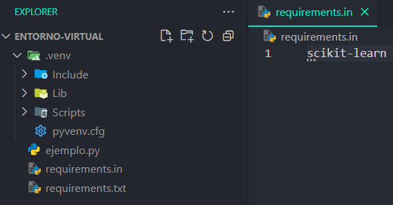
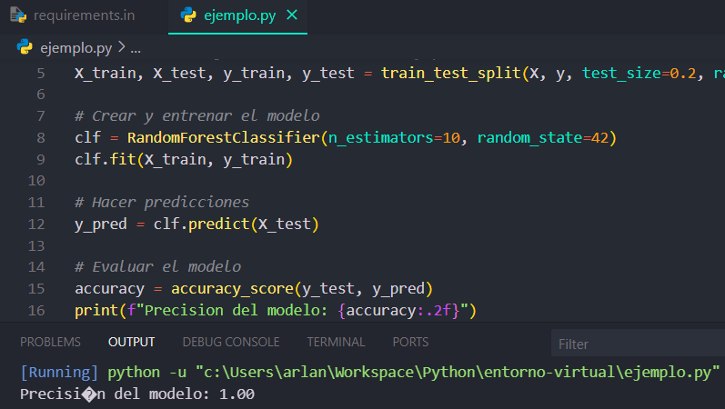

# 🐍 Python venv Windows 🪟

Tutorial sobre como crear un entorno virtual de python e instalar paquetes en el mismo en Windows.





## ⚡️ Requerimientos

- Tener **python** instalado en el sistema.

En caso de no tenerlo visitar la web oficial [aquí](https://www.python.org/downloads/).

## ⚙️ Crear entorno virtual

Dentro de la carpeta de un proyecto, para crear el entorno hay que ejecutar el siguiente comando en la terminal:

```bash
python -m venv nombre_entorno_virtual
```

**NOTA:** el nombre del entorno virtual puede ser cualquiera, sin embargo por convención se usa `.venv`. Al ser precedido por un punto `.` indica que es un elemento oculto, lo cual es importante para proteger datos sensibles.

A continuación se muestra el procedimiento de **activación** y **desactivación** del entorno para el `cmd` y `powershell`.

### CMD

Para **activarlo**

```bash
ruta\a\venv\Scripts\activate.bat
```

Para **desactivarlo** hay dos comandos posibles:

```bash
ruta\a\venv\Scripts\deactivate.bat
```

o simplemente:

```bash
deactivate
```

### Powershell

Puede que al intentar ejecutar scripts haya problemas de permisos. Para solucionarlo se ejecuta lo siguiente:

```bash
Set-ExecutionPolicy -ExecutionPolicy RemoteSigned -Scope CurrentUser
```

Para **activarlo**

```bash
ruta\a\venv\Scripts\activate.ps1
```

Para **desactivarlo**

```bash
deactivate
```

Mas información sobre los entornos virtuales en python [aquí](https://docs.python.org/3/library/venv.html).

## 📦 Instalar paquetes

**NOTA:** el entorno virtual debe estar activo al realizar los siguientes procedimientos.

### 🔨 Individualmente

Para instalar paquetes de forma individual se ejecuta lo siguiente:

```bash
pip install nombre_de_paquete
```

Este método puede resultar en errores de compatibilidad entre distintas versiones, los cuales no siempre reultan sencillos o intuitivos de resolver.

El paquete `pip-tools` resulta útil para instalar paquetes y evitar problemas de compatibilidad entre versiones.

### 🛠️ Utilizando el paquete pip-tools

Lo primero es instalar el paquete:

```bash
pip install pip-tools
```

Se procede a crear un archivo `requirements.in` que contiene los paquetes requeridos para el proyecto.

En el archivo `requirements.in` se indica una `n` cantidad de paquetes a instalar. La versión de los paquetes se maneja de forma automática, aunque se puede especificar la versión de manera opcional.

```
nombre_paquete_1==0.10.1
nombre_paquete_2
nombre_paquete_3==2.7.3
.
.
.
nombre_paquete_n
```

Luego se compila el archivo con los requerimientos, lo cual le indica al sistema que se necesita instalar. Esto resulta en un archivo `requirements.txt`

```bash
pip-compile requirements.in
```

Tras compilar, hay que sincronizar el entorno. Esto realiza la instalación de los paquetes:

```bash
pip-sync
```

Más información sobre pip-tools [aquí](https://github.com/jazzband/pip-tools).

### 🗃️ Excepciones de ciertos paquetes al instalar

Ciertos paquetes forman parte de la biblioteca estándar de Python y se incluyen en la instalación predeterminada. Por lo tanto, no se pueden instalar por separado mediante comandos pip o pip-tools como pip-compile. Más información sobre estos paquetes [aquí](https://www.geeksforgeeks.org/built-in-modules-in-python/).

**NOTA:** para ejecutar los archivos del proyecto el entorno debe estar activo.

Con esto el entorno y los paquetes del proyecto ya están listos.
